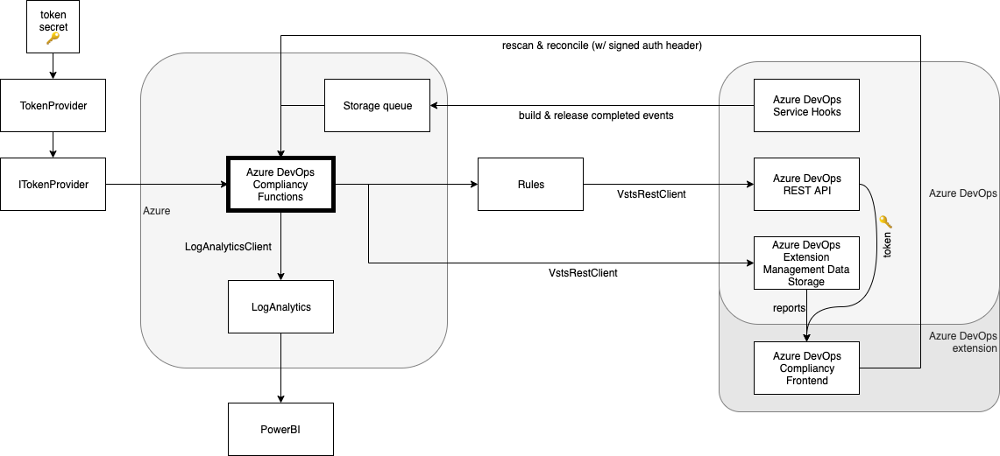
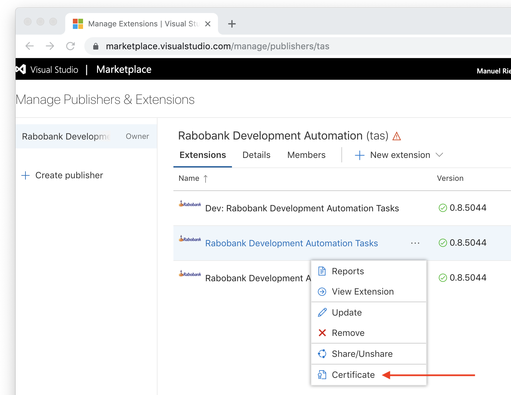
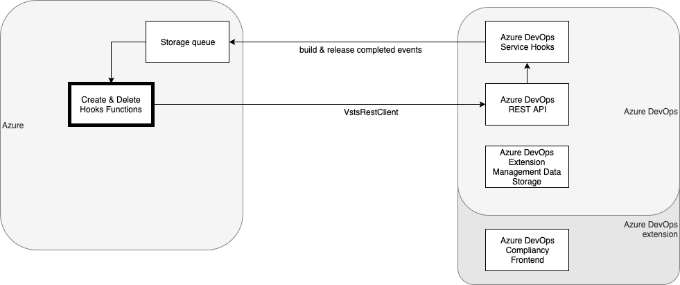
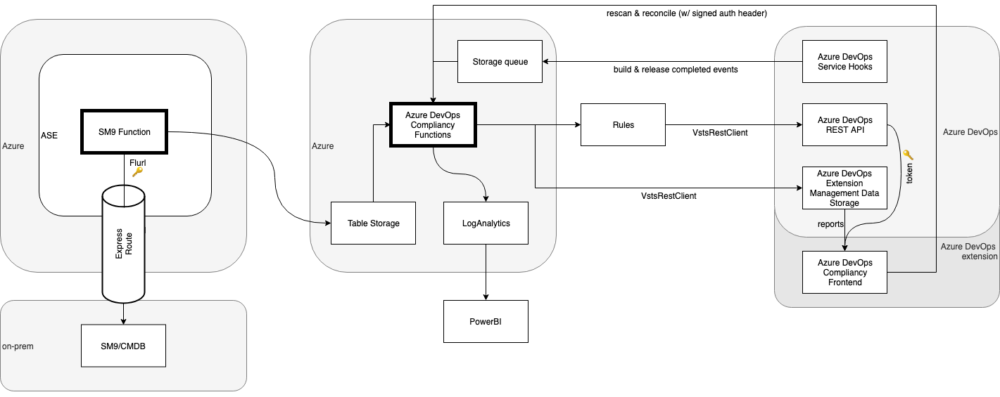

# Functions

type            | function
----------------|----------
Time-triggered  | compliancy check van projecten, repo's en pipelines
Http-triggered  | rescan van compliancy van project
Event-triggered | compliancy check van build & release completed events 
Non-triggered   | het opnieuw proberen van messages in de poison-queue
Time-triggered  | controleren van compleetheid van de compliancy check

## Compliancy

### Rules

Functionele [rules](https://dev.azure.com/raboweb/TAS/_git/azdo-compliancy-rules) voor het controleren en oplossen van compliancy van projecten.

### VstsRestClient

Hand-rolled mockable REST client voor Azure DevOps.

### LogAnalyticsClient

Hand-rolled client voor wegschrijven en uitlezen van records in LogAnalytics.

### Frontend

Azure DevOps frontend extension voor het weergeven van compliancy reports en uitvoeren van reconcile en rescan.

### Shared Secret

Het authorization header dat meekomt vanuit de compliancy frontend in Azure DevOps is signed met het secret van de 
extension en daarop wordt gecontroleerd in de `Tokenizer`. Dit secret wordt meegegeven als secret variable in de pipeline
bij de deployment van de functions.

Mocht je het secret ooit opnieuw nodig hebben, dan kan je deze downloaden in de [marketplace](https://marketplace.visualstudio.com):

## Hooks

Om te reageren op de builds & releases die klaar zijn wordt met behulp van een function
in elk team project een tweetal hooks aangemaakt die het completed event in de storage queue
wegschrijven.

## Completeness

De function controleert of de scan op 600+ team projects succesvol is afgerond. Door throttling
op de REST API en null reference exception in code kan het voorkomen dat analyze voortijdig wordt afgebroken. 

## Configuration Items Deployment Method (SM9)

De koppeling tussen Configuration Items en bijbehorende release piplines is vastgelegd in SM9.
Deze data wordt opgehaald met een function in een aparte resource group met toegang tot de on-premises
CMDB in SM9 en wordt beschikbaar gemaakt via table storage.

